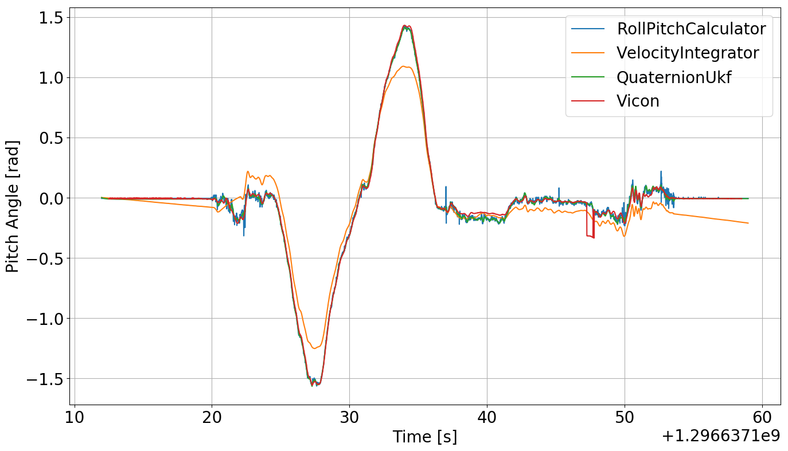

---
# Quaternion UKF


Implentation of an unscented Kalman filter for orientation tracking of a robot (e.g. a quadrotor or drone).

## Introduction

This implementation of a UKF for tracking orientation of a drone with gyro and accelerometer data follows closely that described in the paper "A Quaternion-based Unscented Kalman Filter for Orientation Tracking" by Edgar Kraft.

This project was completed as part of ESE 650: Learning in Robotics at the University of Pennsylvania, though it has been tweaked, and additional infrastructure has been built since then. This additional infrastructure includes a means to manufacture toy data to validate that the filter is indeed working properly.

## Project Setup

Clone repository

``` 
git clone https://github.com/mattlisle/quaternion-ukf.git
```

Create a virtual environment and run setup script (python version should be >= 3.6)

``` 
virtualenv --python=/usr/bin/python /path/to/new/virtualenv
source /path/to/new/virtualenv/bin/activate
make install
```

## Usage

There are three sample datasets to run the code on. To run in terminal:

``` 
make run DATASET=<n>
```

Where `<n>` is a number from 1 to 3.


## Further Documentation

See how the UKF was implemented [here](https://mattlisle.github.io/quaternion-ukf/README.html) as well as the code documentation [here](https://mattlisle.github.io/quaternion-ukf/estimator.html).

In short, the following graphs show how the UKF performed compared to when you consider only the accelerometer *or* the gyro. In all cases, the UKF has the lowest root mean squared error across roll, pitch, and yaw.

### Performance on manufactured data


### Performance on real IMU data





